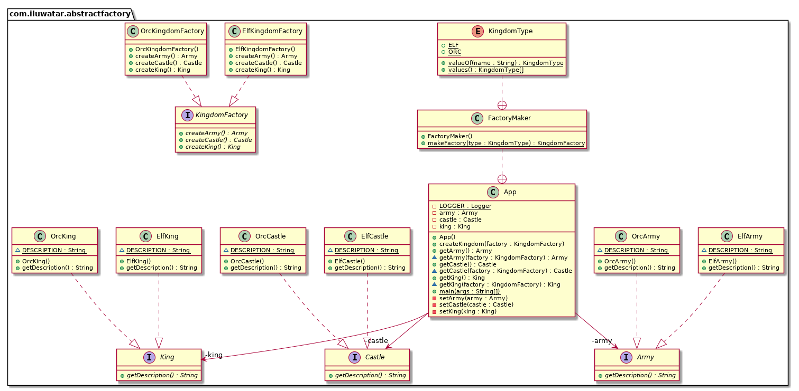

# Java 中的抽象工厂模式：优雅掌控对象创建

---

title: "Java 中的抽象工厂模式：优雅掌控对象创建"
shortTitle: 抽象工厂
description: "通过实际案例、类图和教程，学习 Java 中的抽象工厂模式。了解其目的、适用性、优势和已知用途，提升设计模式知识。"
category: 创建型
language: zh
tag:
- 抽象
- 解耦
- 四人组
- 实例化
- 多态

---

## 又称

* 套件

## 抽象工厂设计模式的目的

Java 中的抽象工厂模式提供了一种接口，用于创建相关或依赖对象家族，而无需指定它们的具体类，增强软件设计的模块性和灵活性。

## 带有实际案例的抽象工厂模式详细解释

现实世界中的例子

> 想象一家家具公司，它使用 Java 中的抽象工厂模式来生产各种风格的家具：现代、维多利亚和乡村。每种风格都包括椅子、桌子和沙发等产品。为了确保每种风格内部的一致性，公司使用抽象工厂模式。
>
> 在这个场景中，抽象工厂是一个接口，用于创建相关家具对象家族（椅子、桌子、沙发）。每个具体工厂（现代家具工厂、维多利亚家具工厂、乡村家具工厂）实现抽象工厂接口，并创建一套符合特定风格的产品。这样，客户可以创建一整套现代或维多利亚家具，而无需担心实例化的细节。这保持了一致的风格，并允许轻松地将一种风格的家具替换为另一种。

直白地说

> 工厂的工厂；一个将单个但相关/依赖的工厂组合在一起的工厂，而无需指定它们的具体类。

维基百科说

> 抽象工厂模式提供了一种方式，将一组具有共同主题的单个工厂封装起来，而无需指定它们的具体类。

## Java 中抽象工厂的编程示例

为了使用抽象工厂模式创建一个王国，我们需要具有共同主题的对象。精灵王国需要精灵国王、精灵城堡和精灵军队，而兽人王国需要兽人国王、兽人城堡和兽人军队。王国中的对象之间存在依赖关系。

将上面的王国示例进行翻译。首先，我们有一些接口和王国中对象的实现。

```java
public interface Castle {
    String getDescription();
}

public interface King {
    String getDescription();
}

public interface Army {
    String getDescription();
}

// 精灵实现 ->
public class ElfCastle implements Castle {
    static final String DESCRIPTION = "这是精灵城堡！";

    @Override
    public String getDescription() {
        return DESCRIPTION;
    }
}

public class ElfKing implements King {
    static final String DESCRIPTION = "这是精灵国王！";

    @Override
    public String getDescription() {
        return DESCRIPTION;
    }
}

public class ElfArmy implements Army {
    static final String DESCRIPTION = "这是精灵军队！";

    @Override
    public String getDescription() {
        return DESCRIPTION;
    }
}

// 兽人实现类似 -> ...
```

然后我们有王国工厂的抽象和实现。

```java
public interface KingdomFactory {
    Castle createCastle();

    King createKing();

    Army createArmy();
}

public class ElfKingdomFactory implements KingdomFactory {

    @Override
    public Castle createCastle() {
        return new ElfCastle();
    }

    @Override
    public King createKing() {
        return new ElfKing();
    }

    @Override
    public Army createArmy() {
        return new ElfArmy();
    }
}

// 兽人实现类似 -> ...
```

现在，我们可以为不同的王国工厂设计一个工厂。在这个例子中，我们创建了`FactoryMaker`，负责返回`ElfKingdomFactory`或`OrcKingdomFactory`的实例。客户端可以使用`FactoryMaker`来创建所需的具象工厂，该工厂将生成不同的具象对象（源自`Army`、`King`、`Castle`）。在这个例子中，我们还使用了一个枚举来参数化客户端将请求的王国工厂类型。

```java
public static class FactoryMaker {

    public enum KingdomType {
        ELF, ORC
    }

    public static KingdomFactory makeFactory(KingdomType type) {
        return switch (type) {
            case ELF -> new ElfKingdomFactory();
            case ORC -> new OrcKingdomFactory();
        };
    }
}
```

这是示例应用程序的主函数：

```java
LOGGER.info("精灵王国");
createKingdom(Kingdom.FactoryMaker.KingdomType.ELF);
LOGGER.info(kingdom.getArmy().getDescription());
LOGGER.info(kingdom.getCastle().getDescription());
LOGGER.info(kingdom.getKing().getDescription());

LOGGER.info("兽人王国");
createKingdom(Kingdom.FactoryMaker.KingdomType.ORC);
LOGGER.info(kingdom.getArmy().getDescription());
LOGGER.info(kingdom.getCastle().getDescription());
LOGGER.info(kingdom.getKing().getDescription());
```

程序输出：

```
07:35:46.340 [main] INFO com.iluwatar.abstractfactory.App -- 精灵王国
07:35:46.343 [main] INFO com.iluwatar.abstractfactory.App -- 这是精灵军队！
07:35:46.343 [main] INFO com.iluwatar.abstractfactory.App -- 这是精灵城堡！
07:35:46.343 [main] INFO com.iluwatar.abstractfactory.App -- 这是精灵国王！
07:35:46.343 [main] INFO com.iluwatar.abstractfactory.App -- 兽人王国
07:35:46.343 [main] INFO com.iluwatar.abstractfactory.App -- 这是兽人军队！
07:35:46.343 [main] INFO com.iluwatar.abstractfactory.App -- 这是兽人城堡！
07:35:46.343 [main] INFO com.iluwatar.abstractfactory.App -- 这是兽人国王！
```

## 抽象工厂模式类图



该 UML 类图围绕“王国”主题展示了 **抽象工厂（Abstract Factory）模式** 的实现，主要关系如下：

1. **`KingdomFactory` 接口**
    - 定义了用于创建王国组成部分的方法：
        - `createArmy() : Army`
        - `createCastle() : Castle`
        - `createKing() : King`
    - 两个实现类：
        - **`ElfKingdomFactory`**：返回精灵族的 `Army`、`Castle`、`King`。
        - **`OrcKingdomFactory`**：返回兽人族的 `Army`、`Castle`、`King`。

2. **抽象的王国组成部分**
    - **`King`** 接口由 **`OrcKing`**、**`ElfKing`** 两个具体类实现。
    - **`Castle`** 接口由 **`OrcCastle`**、**`ElfCastle`** 两个具体类实现。
    - **`Army`** 接口由 **`OrcArmy`**、**`ElfArmy`** 两个具体类实现。
    - 每个具体类都实现了各自的 `getDescription()` 方法，返回相应描述。

3. **`KingdomType` 枚举**
    - 枚举常量：`ELF`、`ORC`。
    - 用来区分要创建的王国类型。

4. **`FactoryMaker` 工具类**
    - 提供 `makeFactory(type: KingdomType): KingdomFactory` 方法。
    - 根据 `KingdomType` 选择并返回相应的 `KingdomFactory` 实例。

5. **`App` 类**
    - 作为示例运行的主类，包含 `army`、`castle`、`king` 等字段。
    - 通过 `createKingdom(factory: KingdomFactory)` 方法，利用注入的工厂创建并设置 `Army`、`Castle`、`King` 对象。
    - 也提供单独的 `getArmy(factory: KingdomFactory)`、`getCastle(factory: KingdomFactory)`、`getKing(factory: KingdomFactory)` 用于获取对应对象。

---

**类图中的主要关系**
- **接口与实现**：
    - `KingdomFactory` 被 `ElfKingdomFactory`、`OrcKingdomFactory` 实现；
    - `King`、`Castle`、`Army` 等接口分别被精灵和兽人的具体类实现。
- **关联 / 依赖**：
    - `App` 通过调用 `FactoryMaker.makeFactory(...)` 来获取 `KingdomFactory`；
    - `App` 使用获取到的工厂来创建 `Army`、`Castle`、`King` 对象。
- **枚举类型**：
    - `KingdomType` 作为区分王国类型的标识，被 `FactoryMaker` 用于选择具体工厂。

这套设计让 **王国的创建流程**与**具体种族实现**解耦，可根据需求灵活切换或拓展新的种族，实现 **高扩展性** 和 **低耦合**。

## 在 Java 中何时使用抽象工厂模式

在以下情况下使用 Java 中的抽象工厂模式：

* 系统应独立于其产品的创建、组合和表示方式。
* 需要使用多个产品家族中的一个来配置系统。
* 必须一起使用相关产品对象家族，强制一致性。
* 希望提供一个产品类库，仅暴露它们的接口，而不是实现。
* 依赖项的生命周期短于消费者。
* 依赖项需要用运行时值或参数构造。
* 需要在运行时选择使用哪个产品家族。
* 添加新产品或家族不应需要修改现有代码。

## 抽象工厂模式 Java 教程

* [Java 中的抽象工厂设计模式 (DigitalOcean)](https://www.digitalocean.com/community/tutorials/abstract-factory-design-pattern-in-java)
* [抽象工厂(Refactoring Guru)](https://refactoring.guru/design-patterns/abstract-factory)

## 抽象工厂模式的优势与权衡

优势：

* 灵活性：无需修改代码即可轻松切换产品家族。
* 解耦：客户端代码仅与抽象接口交互，促进可移植性和可维护性。
* 可重用性：抽象工厂和产品有助于跨项目的组件重用。
* 可维护性：对单个产品家族的更改是局部化的，简化了更新。

权衡：

* 复杂性：定义抽象接口和具体工厂会增加初始开销。
* 间接性：客户端代码通过工厂间接与产品交互，可能降低透明度。

## Java 中抽象工厂模式的实际应用

* Java Swing 的`LookAndFeel`类，用于提供不同的外观选项。
* Java 抽象窗口工具包（AWT）中创建不同 GUI 组件的各种实现。
* [javax.xml.parsers.DocumentBuilderFactory](http://docs.oracle.com/javase/8/docs/api/javax/xml/parsers/DocumentBuilderFactory.html)
* [javax.xml.transform.TransformerFactory](http://docs.oracle.com/javase/8/docs/api/javax/xml/transform/TransformerFactory.html#newInstance--)
* [javax.xml.xpath.XPathFactory](http://docs.oracle.com/javase/8/docs/api/javax/xml/xpath/XPathFactory.html#newInstance--)

## 相关 Java 设计模式

* [工厂方法](https://java-design-patterns.com/patterns/factory-method/): 抽象工厂使用工厂方法来创建产品。
* [单例](https://java-design-patterns.com/patterns/singleton/): 抽象工厂类通常被实现为单例。
* [工厂套件](https://java-design-patterns.com/patterns/factory-kit/): 与抽象工厂类似，但侧重于以灵活的方式配置和管理一组相关对象。

## 参考文献和致谢

* [设计模式：可重用面向对象软件的元素](https://amzn.to/3w0pvKI)
* [Java 中的设计模式](https://amzn.to/3Syw0vC)
* [Head First 设计模式：构建可扩展和可维护的面向对象软件](https://amzn.to/49NGldq)
* [Java 设计模式：通过实际案例获得实践经验](https://amzn.to/3HWNf4U)