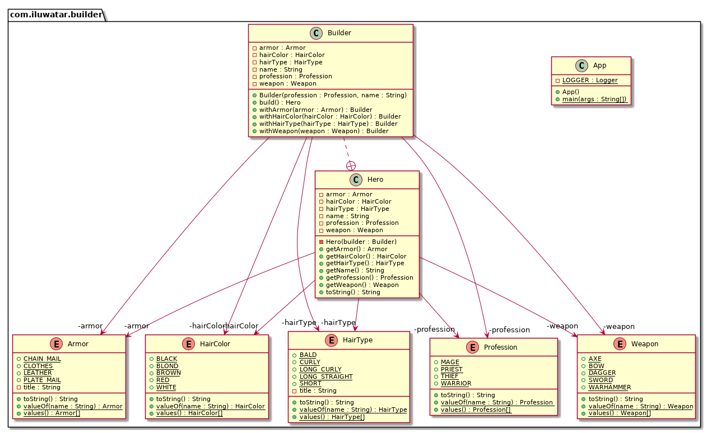

# Java 中的建造者模式：清晰构建自定义对象

---

title: "Java 中的建造者模式：清晰构建自定义对象"
shortTitle: 建造者
description: "了解 Java 中的建造者设计模式，这是一种强大的创建型模式，能够简化对象的构建过程。学习如何将复杂对象的构建与其表示分离，并通过实际案例和应用场景进行讲解。"
category: 创建型
language: zh
tag:
- 四人组
- 实例化
- 对象组合

---

## 建造者设计模式的意图

Java 中的建造者设计模式是一种基础的创建型模式，它允许逐步构建复杂对象。它将复杂对象的构建与其表示分离，以便相同的构建过程可以创建不同的表示。

## 带有实际案例的建造者模式详细解释

现实世界中的例子

> 在对象创建涉及众多参数的情况下，Java 建造者模式特别有用。
>
> 想象一下，你在熟食店制作一个可定制的三明治。在这个上下文中，建造者设计模式将涉及一个三明治建造者（SandwichBuilder），它允许你指定三明治的每个组件，比如面包类型、肉类、奶酪、蔬菜和调味品。你无需从头开始构建三明治，而是使用三明治建造者逐步添加每个所需组件，确保你得到想要的三明治。这种构建与最终产品表示的分离确保了相同的构建过程可以根据指定的组件生成不同类型的三明治。

直白地说

> 它允许你创建不同变体的对象，同时避免构造函数的污染。在可能存在多种对象变体或创建对象涉及许多步骤时非常有用。

维基百科说

> 建造者模式是一种对象创建软件设计模式，旨在为望远镜式构造函数反模式提供解决方案。

考虑到这一点，让我们解释一下望远镜式构造函数反模式是什么。在某个时候，我们都遇到过像下面这样的构造函数：

```java
public Hero(Profession profession,String name,HairType hairType,HairColor hairColor,Armor armor,Weapon weapon){
    // 值赋值
}
```

如你所见，构造函数参数的数量可能会迅速变得难以承受，使其难以理解它们的排列。此外，如果你决定以后添加更多选项，这个参数列表可能会继续增长。这就是所谓的望远镜式构造函数反模式。

## Java 中建造者模式的编程示例

在这个 Java 建造者模式示例中，我们构建具有不同属性的 `Hero` 对象。

想象一个角色扮演游戏的角色生成器。最简单的选项是让计算机为你生成角色。然而，如果你更喜欢手动选择角色细节，如职业、性别、头发颜色等，角色创建就变成了一个逐步的过程，一旦所有选择都完成，该过程即告结束。

更合理的做法是使用建造者模式。首先，让我们考虑我们要创建的 `Hero`：

```java
public final class Hero {
    private final Profession profession;
    private final String name;
    private final HairType hairType;
    private final HairColor hairColor;
    private final Armor armor;
    private final Weapon weapon;

    private Hero(Builder builder) {
        this.profession = builder.profession;
        this.name = builder.name;
        this.hairColor = builder.hairColor;
        this.hairType = builder.hairType;
        this.weapon = builder.weapon;
        this.armor = builder.armor;
    }
}
```

然后我们有 `Builder`：

```java
  public static class Builder {
    private final Profession profession;
    private final String name;
    private HairType hairType;
    private HairColor hairColor;
    private Armor armor;
    private Weapon weapon;

    public Builder(Profession profession, String name) {
        if (profession == null || name == null) {
            throw new IllegalArgumentException("profession and name can not be null");
        }
        this.profession = profession;
        this.name = name;
    }

    public Builder withHairType(HairType hairType) {
        this.hairType = hairType;
        return this;
    }

    public Builder withHairColor(HairColor hairColor) {
        this.hairColor = hairColor;
        return this;
    }

    public Builder withArmor(Armor armor) {
        this.armor = armor;
        return this;
    }

    public Builder withWeapon(Weapon weapon) {
        this.weapon = weapon;
        return this;
    }

    public Hero build() {
        return new Hero(this);
    }
}
```

然后可以这样使用：

```java
  public static void main(String[] args) {

    var mage = new Hero.Builder(Profession.MAGE, "Riobard")
            .withHairColor(HairColor.BLACK)
            .withWeapon(Weapon.DAGGER)
            .build();
    LOGGER.info(mage.toString());

    var warrior = new Hero.Builder(Profession.WARRIOR, "Amberjill")
            .withHairColor(HairColor.BLOND)
            .withHairType(HairType.LONG_CURLY).withArmor(Armor.CHAIN_MAIL).withWeapon(Weapon.SWORD)
            .build();
    LOGGER.info(warrior.toString());

    var thief = new Hero.Builder(Profession.THIEF, "Desmond")
            .withHairType(HairType.BALD)
            .withWeapon(Weapon.BOW)
            .build();
    LOGGER.info(thief.toString());
}
```

程序输出：

```
16:28:06.058 [main] INFO com.iluwatar.builder.App -- 这是一个名为 Riobard 的法师，黑色头发，手持匕首。
16:28:06.060 [main] INFO com.iluwatar.builder.App -- 这是一个名为 Amberjill 的战士，金色长卷发，穿着锁子甲，手持剑。
16:28:06.060 [main] INFO com.iluwatar.builder.App -- 这是一个名为 Desmond 的盗贼，秃头，手持弓。
```

## 建造者模式类图



## 在 Java 中何时使用建造者模式

在以下情况下使用建造者模式

* 建造者模式适用于需要创建复杂对象的 Java 应用程序。
* 创建复杂对象的算法应独立于构成对象的部件以及它们的组装方式
* 构建过程必须允许对构建的对象进行不同的表示
* 当产品需要很多步骤来创建，并且这些步骤需要按特定顺序执行时特别有用

## Java 建造者模式教程

* [Java 中的建造者设计模式 (DigitalOcean)](https://www.journaldev.com/1425/builder-design-pattern-in-java)
* [建造者 (Refactoring Guru)](https://refactoring.guru/design-patterns/builder)
* [探索 Joshua Bloch 的 Java 中的建造者设计模式 (Java Magazine)](https://blogs.oracle.com/javamagazine/post/exploring-joshua-blochs-builder-design-pattern-in-java)

## Java 中建造者模式的实际应用

* Java 中的 `StringBuilder` 用于构建字符串。
* `java.lang.StringBuffer` 用于创建可变字符串对象。
* Java.nio.ByteBuffer 以及类似的缓冲区，如 FloatBuffer、IntBuffer 等
* `javax.swing.GroupLayout.Group#addComponent()`
* IDE 中的各种 GUI 构建器，用于构建 UI 组件。
* 所有实现 [java.lang.Appendable](http://docs.oracle.com/javase/8/docs/api/java/lang/Appendable.html) 的类
* [Apache Camel 构建器](https://github.com/apache/camel/tree/0e195428ee04531be27a0b659005e3aa8d159d23/camel-core/src/main/java/org/apache/camel/builder)
* [Apache Commons Option.Builder](https://commons.apache.org/proper/commons-cli/apidocs/org/apache/commons/cli/Option.Builder.html)

## 建造者模式的优势与权衡

优势：

* 与其它创建型模式相比，对构建过程有更多控制
* 支持逐步构建对象，延迟构建步骤或递归执行步骤
* 可以构建需要复杂组装子对象的对象。最终产品与其组成部分以及它们的组装过程分离
* 单一职责原则。你可以将复杂的构建代码从业务逻辑中分离出来

权衡：

* 由于该模式需要创建多个新类，代码的总体复杂性可能会增加
* 可能会增加内存使用量，因为需要创建多个构建器对象

## 相关 Java 设计模式

* [抽象工厂](https://java-design-patterns.com/patterns/abstract-factory/): 可以与建造者结合使用，以构建复杂对象的各个部分。
* [原型](https://java-design-patterns.com/patterns/prototype/): 构建器通常从原型创建对象。
* [步骤构建器](https://java-design-patterns.com/patterns/step-builder/): 这是建造者模式的一种变体，通过逐步方法生成复杂对象。当需要构建具有大量可选参数的对象，并且希望避免望远镜式构造函数反模式时，步骤构建器模式是一个不错的选择。

## 参考文献和致谢

* [设计模式：可重用面向对象软件的元素](https://amzn.to/3w0pvKI)
* [Effective Java](https://amzn.to/4cGk2Jz)
* [Head First 设计模式：构建可扩展和可维护的面向对象软件](https://amzn.to/49NGldq)
* [重构到模式](https://amzn.to/3VOO4F5)