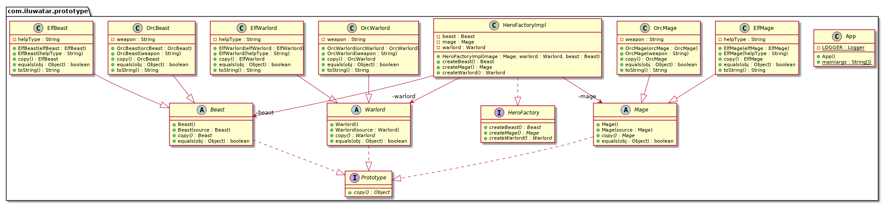

# Java 中的原型模式：掌握对象克隆以实现高效实例化

---

- title: "Java 中的原型模式：掌握对象克隆以实现高效实例化"
- shortTitle: 原型
- description: "通过本指南深入探讨 Java 中的原型设计模式，了解其实现、优势和实际应用场景。学习如何在 Java 应用中高效克隆对象并管理对象创建。"
- category: 创建型
- language: zh
- tag:
  - 四人组
  - 实例化
  - 对象组合
  - 多态

---

## 又称

* 克隆

## 原型设计模式的意图

原型模式用于通过原型实例指定要创建的对象类型，并通过对象克隆创建新实例。

## 带有实际案例的原型模式详细解释

现实世界中的例子

> 想象一家制造定制家具的公司。每次接到订单时，他们不会从头开始制作每一件家具，而是保留最流行设计的原型。当客户订购特定设计时，公司只需克隆该设计的原型并进行必要的定制。这种方法节省了时间和资源，因为基本结构和设计细节已经就绪，使公司能够快速交付质量一致的订单。
>
> 在这个场景中，家具原型就像软件中的对象原型，可以基于现有模型高效创建新的、定制化的实例。

直白地说

> 通过克隆现有对象来创建新对象。

维基百科说

> 原型模式是软件开发中的一种创建型设计模式。它用于当要创建的对象类型由原型实例决定时，通过克隆原型来产生新对象。

## Java 中原型模式的编程示例

在 Java 中，建议将原型模式实现如下。首先，创建一个带有克隆对象方法的接口。在这个例子中，`Prototype` 接口通过其 `copy` 方法实现了这一功能。

```java
public abstract class Prototype<T> implements Cloneable {
    @SneakyThrows
    public T copy() {
        return (T) super.clone();
    }
}
```

我们的示例包含一个不同生物的继承体系。例如，我们来看 `Beast` 和 `OrcBeast` 类。

```java
@EqualsAndHashCode(callSuper = false)
@NoArgsConstructor
public abstract class Beast extends Prototype<Beast> {
  public Beast(Beast source) {}
}
```

```java
@EqualsAndHashCode(callSuper = false)
@RequiredArgsConstructor
public class OrcBeast extends Beast {

  private final String weapon;

  public OrcBeast(OrcBeast orcBeast) {
    super(orcBeast);
    this.weapon = orcBeast.weapon;
  }

  @Override
  public String toString() {
    return "Orcish wolf attacks with " + weapon;
  }
}
```

我们不想陷入太多细节，但完整的示例还包含基础类 `Mage` 和 `Warlord`，以及精灵和兽人的专门实现。

为了充分利用原型模式，我们创建了 `HeroFactory` 和 `HeroFactoryImpl` 类，用于从原型生产不同种类的生物。

```java
public interface HeroFactory {
  Mage createMage();
  Warlord createWarlord();
  Beast createBeast();
}
```

```java
@RequiredArgsConstructor
public class HeroFactoryImpl implements HeroFactory {

  private final Mage mage;
  private final Warlord warlord;
  private final Beast beast;

  public Mage createMage() {
    return mage.copy();
  }

  public Warlord createWarlord() {
    return warlord.copy();
  }

  public Beast createBeast() {
    return beast.copy();
  }
}
```

现在，我们可以通过克隆现有实例来展示原型模式的完整功能，生成新的生物。

```java
public static void main(String[] args) {
    var factory = new HeroFactoryImpl(
            new ElfMage("cooking"),
            new ElfWarlord("cleaning"),
            new ElfBeast("protecting")
    );
    var mage = factory.createMage();
    var warlord = factory.createWarlord();
    var beast = factory.createBeast();
    LOGGER.info(mage.toString());
    LOGGER.info(warlord.toString());
    LOGGER.info(beast.toString());

    factory = new HeroFactoryImpl(
            new OrcMage("axe"),
            new OrcWarlord("sword"),
            new OrcBeast("laser")
    );
    mage = factory.createMage();
    warlord = factory.createWarlord();
    beast = factory.createBeast();
    LOGGER.info(mage.toString());
    LOGGER.info(warlord.toString());
    LOGGER.info(beast.toString());
}
```

以下是运行示例后的控制台输出。

```
08:36:19.012 [main] INFO com.iluwatar.prototype.App -- 精灵魔法师帮助烹饪
08:36:19.013 [main] INFO com.iluwatar.prototype.App -- 精灵领主帮助清洁
08:36:19.014 [main] INFO com.iluwatar.prototype.App -- 精灵鹰帮助保护
08:36:19.014 [main] INFO com.iluwatar.prototype.App -- 兽人魔法师用斧头攻击
08:36:19.014 [main] INFO com.iluwatar.prototype.App -- 兽人领主用剑攻击
08:36:19.014 [main] INFO com.iluwatar.prototype.App -- 兽人狼用激光攻击
```

## 带有实际案例的原型模式详细解释



## 在 Java 中何时使用原型模式

* 当需要在运行时指定要实例化的类，例如通过动态加载时。
* 为了避免构建与产品类层次结构平行的工厂类层次结构。
* 当一个类的实例可以有多种状态组合中的一种时，通过安装相应数量的原型并克隆它们，而不是每次手动实例化类并设置适当状态，可能会更方便。
* 当对象创建成本较高时，克隆可能更高效。
* 当需要克隆的具象类在运行时才确定。

## 原型模式在 Java 中的实际应用

* 在 Java 中，`Object.clone()` 方法是原型模式的经典实现。
* GUI 库通常使用原型来创建按钮、窗口和其他小部件。
* 在游戏开发中，创建具有相似属性的多个对象（如敌方角色）。

## 原型模式的优势与权衡

优势：

在 Java 应用中运用原型模式

* 隐藏了实例化新对象的复杂性。
* 减少了类的数量。
* 允许在运行时添加和移除对象。

权衡：

* 需要实现克隆机制，这可能会比较复杂。
* 深克隆尤其难以正确实现，特别是当类具有复杂的对象图和循环引用时。

## 相关 Java 设计模式

* [抽象工厂](https://java-design-patterns.com/patterns/abstract-factory/)：两者都涉及创建对象，但原型模式通过克隆原型实例来创建对象，而抽象工厂则使用工厂方法创建对象。
* [单例](https://java-design-patterns.com/patterns/singleton/)：如果单例允许克隆其单个实例，它可以使用原型来创建实例。
* [组合](https://java-design-patterns.com/patterns/composite/)：原型通常在组合内部使用，以允许动态创建组件树。

## 参考文献和致谢

* [设计模式：可重用面向对象软件的元素](https://amzn.to/3w0pvKI)
* [Effective Java](https://amzn.to/4cGk2Jz)
* [Head First 设计模式：构建可扩展和可维护的面向对象软件](https://amzn.to/49NGldq)
* [Java 设计模式：通过实际案例获得实践经验](https://amzn.to/3yhh525)